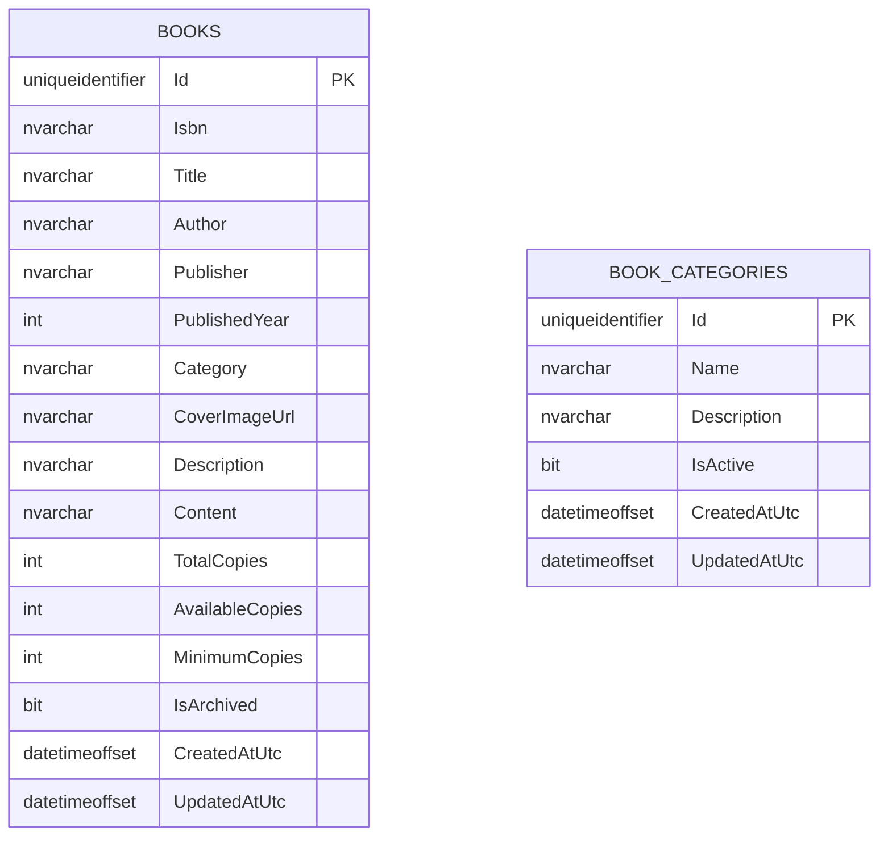
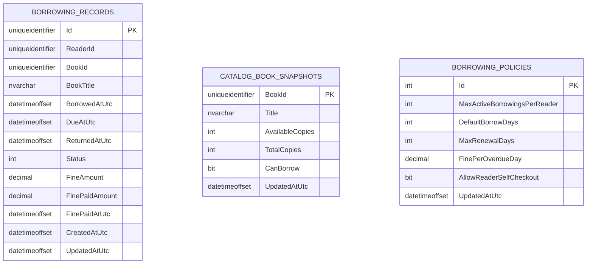
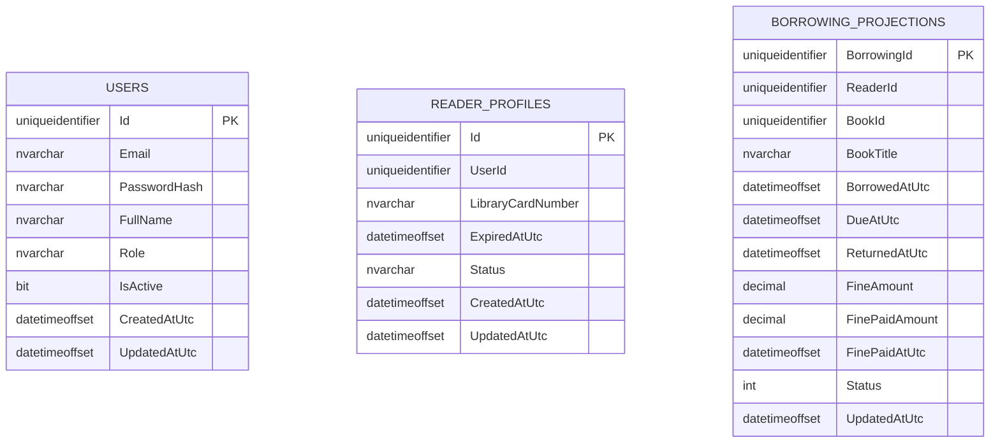

# Database ERD

Sơ đồ dưới đây bám theo đúng 3 file SQL hiện tại trong `database/`.

Lưu ý:

- Đây là kiến trúc microservices nên **không có foreign key chéo database**.
- Một số cột là **reference logic** hoặc **snapshot**, không phải ràng buộc SQL cứng.

## 1. CatalogDb

- `Books.Category` là text thường, dùng để hiển thị và tìm kiếm.
- `BookCategories` là bảng danh mục chuẩn hoá theo tên.
- Hiện tại **không có FK trực tiếp** giữa `Books` và `BookCategories`.

## 2. CirculationDb

- `BorrowingRecords.ReaderId` là reference logic sang `IdentityDb`.
- `BorrowingRecords.BookId` là reference logic sang `CatalogDb`.
- `CatalogBookSnapshots` là bảng snapshot để lưu trạng thái sách phục vụ mượn/trả.
- `BorrowingPolicies` là bảng cấu hình nghiệp vụ, chỉ có 1 dòng chính.

## 3. IdentityDb

- `ReaderProfiles.UserId` là reference logic sang `Users.Id`.
- `BorrowingProjections` là bảng projection/báo cáo được cập nhật từ event mượn-trả.
- Đây không phải bảng nguồn gốc duy nhất của mượn/trả; dữ liệu gốc vẫn nằm ở `CirculationDb`.

## 4. Tóm tắt luồng dữ liệu

- `CatalogDb` giữ dữ liệu sách gốc.
- `CirculationDb` giữ giao dịch mượn/trả và luật mượn.
- `IdentityDb` giữ tài khoản, hồ sơ độc giả và projection báo cáo.
- Các service trao đổi qua API/event, không join SQL chéo database.

